# Funnel 2.0 — Object Lineage

Object lineage and join/relationship reference for the **Funnel 2.0** report table
`discovery_auto.auto_analytics.prsls_ldmg_actv_dy`.

The report is a daily lead-to-invoice funnel aggregate. It is assembled from raw SAP C4C
objects, through two curated `*_long` data products, into five metric streams that are
`UNION ALL`-ed and aggregated.

## Build order (notebooks)

| # | Notebook | Output object | Depends on |
|---|----------|---------------|-----------|
| 1 | `customer_leads_long` | `discovery_auto.auto_analytics.customer_leads_long` | SAP C4C leads + dimensions |
| 2 | `customer_enquiries_long` | `discovery_auto.auto_analytics.customer_enquiries_long` | SAP C4C opportunities/quotations + **customer_leads_long** |
| 3 | `prsls_ldmg_actv_dy` | `discovery_auto.auto_analytics.prsls_ldmg_actv_dy` | both `*_long` products + sales facts |

> **Cross-notebook dependency:** enquiries reads leads, so leads must run first.
> Both `*_long` tables are written to `discovery_auto.auto_analytics.*`, but the funnel
> notebook reads their promoted copies in `prod_auto.gold_virtual.*` — same objects, one
> layer downstream.

## Lineage diagram

```mermaid
flowchart TD
  %% ---------- SAP C4C sources ----------
  subgraph SRC["SAP C4C source layer · prod_auto.gold_virtual"]
    L[sap_c4c_leads]
    FUA[sap_c4c_follow_up_activities]
    OH[sap_c4c_opportunity_header]
    OI[sap_c4c_opportunity_item]
    QH[sap_c4c_quotation_header]
    QI[sap_c4c_quotation_item]
    SOH[sap_c4c_sales_order_header]
    MSOR[sap_c4c_missing_sales_order_ref]
    EMP[sap_c4c_employee_master_collection]
  end

  %% ---------- dimensions / lookups ----------
  subgraph DIM["Dimensions & lookups"]
    CST[CSTMR_DMGR_PRFL_CS]
    CMP[cdm_automotive_campaign]
    TXT["pad_100_*_texts<br/>office · group · division · channel · organization"]
    FTB[pad_100_fastrack_branch_sales_area_map]
    SDH[pad_100_sales_document_header]
    SDR[sap_sales_document_references]
    CEC[cec_followup_actions_lkp]
    DTL[c4c_document_type_lkp]
    C4SO[c4c_sales_offices_lkp]
    LTM[lead_type_mapping_new]
  end

  %% ---------- data products ----------
  CLL[["customer_leads_long"]]
  CEL[["customer_enquiries_long"]]

  %% ---------- sales facts ----------
  subgraph FACT["Sales facts · prod_auto.gold_serve_virtual"]
    SORD[sales_ordr_vn_d]
    SINV[sales_newu_usud_sals_vn_d_view]
  end

  %% ---------- target ----------
  TGT((("prsls_ldmg_actv_dy<br/>Funnel 2.0")))

  %% leads_long
  L -->|latest per lead_id| CLL
  FUA -->|c4cleadid = lead_id| CLL
  CST --> CLL
  CMP --> CLL
  TXT --> CLL
  FTB --> CLL
  EMP --> CLL
  CEC --> CLL
  LTM --> CLL
  C4SO --> CLL

  %% enquiries_long
  OH -->|latest per opportunity_id| CEL
  OI -->|opportunity_id| CEL
  FUA -->|opportunityid| CEL
  QH --> CEL
  QI --> CEL
  SOH --> CEL
  MSOR --> CEL
  DTL --> CEL
  SDH --> CEL
  SDR --> CEL
  CST --> CEL
  EMP --> CEL
  TXT --> CEL
  FTB --> CEL
  LTM --> CEL
  CLL -->|lead_id → walk-in flag| CEL

  %% funnel
  CLL -->|CUSTOMER_LEADS| TGT
  CEL -->|CUSTOMER_ENQUIRIES / TESTDRIVES| TGT
  SORD -->|enquiry_id| TGT
  SINV -->|sales_order_number = sales_document| TGT

  classDef src fill:#fdf0dd,stroke:#b5730f,color:#5b3a06;
  classDef dim fill:#eef1f4,stroke:#5b6774,color:#2b333b;
  classDef prod fill:#ecedfb,stroke:#5b5fe0,color:#2d2f7a;
  classDef fact fill:#e5f5ec,stroke:#2f9e64,color:#12482c;
  classDef tgt fill:#dcf3ef,stroke:#0e8f82,color:#08423b;
  class L,FUA,OH,OI,QH,QI,SOH,MSOR,EMP src;
  class CST,CMP,TXT,FTB,SDH,SDR,CEC,DTL,C4SO,LTM dim;
  class CLL,CEL prod;
  class SORD,SINV fact;
  class TGT tgt;
```



## Data product build recipes

### `customer_leads_long`
Driving source: **`sap_c4c_leads`** (parsed), deduped to the latest row per `LPAD(lead_id,10)`
via `QUALIFY ROW_NUMBER()`. Filter `sales_organisation <> '5000'`.

| Joined object | Join key | Purpose |
|---------------|----------|---------|
| `CSTMR_DMGR_PRFL_CS` | `TRIM(customer_id)` | customer profile |
| `sap_c4c_follow_up_activities` | `c4cleadid = lead_id` | first action, visits, test-drive times |
| `pad_100_sales_office_texts` | `substr(sales_office,1,4)` | office description |
| `pad_100_sales_group_texts` | `sales_group` (lang=E) | group description |
| `pad_100_sales_division_texts` | `division` (lang=E) | division / brand |
| `pad_100_distribution_channel_texts` | `distribution_channel` | channel |
| `pad_100_sales_organization_texts` | `sales_organization` | org |
| `pad_100_fastrack_branch_sales_area_map` | `fasttrack_branch_id = branch prefix` | branch name |
| `sap_c4c_employee_master_collection` | `sales_executive_id = employeeid` | SE name |
| `cec_followup_actions_lkp` | `action_code = followupbycec` | CEC action |
| `cdm_automotive_campaign` | `leadcampaign = campaign_id` | campaign name |
| `lead_type_mapping_new` | normalized `lead_source ≈ lead_source_src` | type / group / sub-type |
| `c4c_sales_offices_lkp` | `c4c_sales_office = sales_office` | walk-in / pop-up flag |

### `customer_enquiries_long`
Driving source: **`sap_c4c_opportunity_header`** (exploded), latest row per `opportunity_id`.
Filter `sales_orgnisation_code <> '5000'`.

| Joined object | Join key | Purpose |
|---------------|----------|---------|
| `sap_c4c_opportunity_item` | `opportunity_id` (+ item rank) | vehicle / material lines |
| `sap_c4c_follow_up_activities` | `opportunityid` | activity & test-drive milestones |
| `CSTMR_DMGR_PRFL_CS` | `customer_id` | customer profile |
| `sap_c4c_employee_master_collection` | `staff / sales_exec = employeeid` | SE name |
| `pad_100_*_texts` | office · group · division · channel · organization (lang=E) | descriptions |
| `pad_100_fastrack_branch_sales_area_map` | `branch_id` | branch name |
| `pad_100_sales_document_header` ⋈ `sap_sales_document_references` | `opportunity_id / order_number` | SAP sales-order number |
| `sap_c4c_quotation_header/_item`, `c4c_document_type_lkp`, `sap_c4c_missing_sales_order_ref`, `sap_c4c_sales_order_header` | `quotation_id` | quotations CTE |
| `lead_type_mapping_new` | normalized `enquiry_source` | type / group |
| `customer_leads_long` | `lead_id` (pop-up leads) | walk-in flag |

## Funnel assembly (`prsls_ldmg_actv_dy`)

Five streams each select the same 19 dimension columns + their own measures (zero-filling the
rest), then `UNION ALL` and `GROUP BY` all dimensions.

| Stream | Primary input | Key relationship |
|--------|---------------|------------------|
| `CUSTOMER_LEADS` | `customer_leads_long` | — (leads, hot, CEC/SE actioned, lost reasons) |
| `CUSTOMER_ENQUIRIES` | `customer_enquiries_long` ⋈ `ENQUIRY_STATUS_REASON_MAP` | `enquiry_status_reason` |
| `CUSTOMER_TESTDRIVES` | `customer_enquiries_long` | — (booked/completed/open/no-show/cancelled) |
| `CUSTOMER_ORDERS` | `sales_ordr_vn_d` ⋈ `customer_enquiries_long` | `enquiry_id` |
| `CUSTOMER_INVOICES` | `sales_newu_usud_sals_vn_d_view` ⋈ `sales_ordr_vn_d` ⋈ `customer_enquiries_long` | `sales_order_number = sales_document → enquiry_id` |

Final enrichment joins on the unioned `LEAD_FUNNEL` (filter `reporting_date >= 2024-01-01`):

| Joined object | Join key |
|---------------|----------|
| `eudu_mdata_dtac_orgstrc` (ORG + POPUP_ORG) | `sales_org_code · division_code · sales_office_code` |
| `mdata_org_sales_organization` | `sales_organization_code` |
| `pad_100_sales_group_texts` | `sales_group_code` (lang=E) |
| `pad_100_distribution_channel_texts` | `distribution_channel_code` (lang=E) |

## Spine keys

The funnel journey is stitched by:

```
lead_id  →  enquiry_id (opportunity_id)  →  sales_document  →  sales_order_number
```

plus a **web-attribution** back-join from enquiries to leads on `right(mobile,9)` + `division`
within a ±120-day window, which recovers walk-ins that originated as web/social leads.

Result grain: `reporting_date × org_key × sales org / division / group / office × channel ×
sales executive × make / model × group / type / source`.
