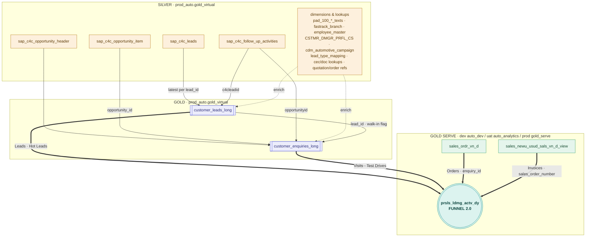

# Funnel 2.0 — Definition & Lineage

**Report table:** `prsls_ldmg_actv_dy` — a daily lead-to-invoice sales funnel aggregate for
the automotive business.

Funnel 2.0 stitches the full customer journey — **Leads → Hot Leads → Visits → Test Drives →
Orders → Invoices** — into one row per day per organisational / vehicle dimension, so each
stage of the funnel can be measured and compared on a single grain.

---

## 1. Medallion architecture & environments

The pipeline spans three Databricks layers. **Silver** and **Gold** share a single
environment schema; **Gold Serve** (where Funnel 2.0 lives) is deployed across dev / uat / prod.

| Layer | Role | Dev | UAT | Prod |
|-------|------|-----|-----|------|
| **Silver** | Parsed SAP C4C source objects + dimensions | `prod_auto.gold_virtual` | `prod_auto.gold_virtual` | `prod_auto.gold_virtual` |
| **Gold** | Curated `*_long` data products | `prod_auto.gold_virtual` | `prod_auto.gold_virtual` | `prod_auto.gold_virtual` |
| **Gold Serve** | Serving facts + Funnel 2.0 aggregate | `discovery_auto.auto_dev` | `discovery_auto.auto_analytics` | `prod_auto.gold_serve` |

**Fully-qualified name of the Funnel 2.0 table per environment:**

| Env | Object |
|-----|--------|
| Dev | `discovery_auto.auto_dev.prsls_ldmg_actv_dy` |
| UAT | `discovery_auto.auto_analytics.prsls_ldmg_actv_dy` |
| Prod | `prod_auto.gold_serve.prsls_ldmg_actv_dy` |

> **Note on the current notebook:** the build notebook reads the Gold data products from
> `prod_auto.gold_virtual.*`, reads the Gold-Serve sales facts from the
> `prod_auto.gold_serve_virtual.*` view layer, and writes the output to
> `discovery_auto.auto_analytics.prsls_ldmg_actv_dy` (the **UAT** Gold-Serve schema).

---

## 2. Funnel KPIs

The six headline KPIs and where each is sourced across the layers. "Measure column" is the
field in `prsls_ldmg_actv_dy`; the funnel notebook builds one stream per KPI family and
`UNION ALL`s them.

| # | KPI | Silver source | Gold product | Gold-Serve stream | Measure column(s) |
|---|-----|---------------|--------------|-------------------|-------------------|
| 1 | **Leads** | `sap_c4c_leads` | `customer_leads_long` | `CUSTOMER_LEADS` | `leads`, `leads_without_walkins` |
| 2 | **Hot Leads** | `sap_c4c_leads` | `customer_leads_long` | `CUSTOMER_LEADS` | `hot_leads`, `hot_leads_without_walkins` |
| 3 | **Visits** (opportunities) | `sap_c4c_opportunity_header`, `sap_c4c_opportunity_item` | `customer_enquiries_long` | `CUSTOMER_ENQUIRIES` | `opportunities`, `open_opportunities_14d` |
| 4 | **Test Drives** | `sap_c4c_follow_up_activities` | `customer_enquiries_long` | `CUSTOMER_TESTDRIVES` | `test_drives_booked`, `test_drives_completed`, `test_drives_oepn`, `test_drives_noshow`, `test_drives_cancelled` |
| 5 | **Total Reservation** | — | — | `CUSTOMER_ORDERS` ← `sales_ordr_vn_d` | `total_order_items` (SUM item_quantity), `orders`, `orders_with_deposite`, `reservation_items_*` |
| 6 | **Invoices** | `PAD_100_billing_details_new` (billing) | `sales_newu_sals_vn_d` (new) + `sales_usdu_sals_vn_d` (used) → `sales_newu_usud_sals_vn_d_view` | `CUSTOMER_INVOICES` ← `sales_newu_usud_sals_vn_d_view` | `invoices` |

Every KPI also has a **`web_attributed_*`** counterpart (web/social origin, plus walk-ins
recovered by the mobile-number back-join), and enquiries carry **lost-opportunity** reason
breakdowns (`lost_oppo_*`).

> **Attribution scope.** Total Reservation (`total_order_items`) counts **all** reservation
> order types (`ZOR`/`YOR`/`TA` = Standard / Fleet / AFM Corporate) with **no `sales_group`
> filter**; Invoices count **all** billing lines (`sales_volume_quantity`, deduped via
> `flag_cancellation = 0`) with no `sales_group` filter — so both include retail, fleet and
> corporate. The enquiry join
> (`sales_ordr_vn_d.enquiry_id → customer_enquiries_long`) is `LEFT`, so orders with no C4C
> enquiry — fleet / corporate / direct, whose `enquiry_id` is a constructed `org+div+office`
> token like `209226Y211`, expected because **C4C is retail-focused** — still count in the KPI
> but carry no enquiry link. The **`web_attributed_*`** metrics are additionally scoped to
> **retail / ecommerce only** via the lead back-join filter `sales_group IN ('001','040')`, so
> fleet / corporate and unattributed reservations are deliberately excluded from web attribution.
>
> Unattributed reservations fall into two root causes:
> - **`enquiry_id` present but not in gold → opportunity-id leakage** — the order references an
>   opportunity/enquiry that never landed in `customer_enquiries_long` (enquiries-pipeline gap).
> - **`enquiry_id` null → missing mapping in SAP** — the order was never linked to an
>   opportunity at source (typical for fleet / corporate / direct).

### KPI definitions (business logic)

| KPI | Definition |
|-----|-----------|
| **Leads** | `COUNT(DISTINCT lead_id)` from `customer_leads_long` (excludes org `5000`). `leads_without_walkins` excludes pop-up/walk-in leads. |
| **Hot Leads** | Lead where `lead_qualification = 'Hot'` **or** `pass_to_branch_time IS NOT NULL`. |
| **Visits** | `COUNT(1)` opportunities in `customer_enquiries_long`; `open_opportunities_14d` = still `Open` with test-drive gap > 15 days. |
| **Test Drives** | Booked = any test-drive open/complete/cancel time; Completed = `testdrive_time` set; Open / No-show / Cancelled derived from open time vs `CURRENT_DATE` and cancel time. |
| **Orders** | `COUNT(DISTINCT sales_document)` from `sales_ordr_vn_d` where `order_type IN ('ZOR','YOR','TA')`; item counts use `SUM(item_quantity)`. |
| **Invoices** | `SUM(invoices)` from `sales_newu_usud_sals_vn_d_view`, where `invoices = sales_volume_quantity` (billing-line volume) dated by `billing_date`. Deduped via `flag_cancellation = 0` (drops cancellation lines `qty = -1`, superseded rebills, and non-latest duplicate billing documents per batch). New / Used split by distribution channel (10 / 20). |

---

## 3. Object lineage



**Journey spine keys**

```
lead_id  →  enquiry_id (opportunity_id)  →  sales_document  →  sales_order_number
```

Plus a **web-attribution** back-join (enquiry → lead on `right(mobile,9)` + `division`
within a ±120-day window) that recovers walk-ins originating as web/social leads.

---

## 4. Data product build recipes (Gold)

### `customer_leads_long` — Leads & Hot Leads
Driven by **`sap_c4c_leads`** (deduped to the latest row per `LPAD(lead_id,10)` via
`QUALIFY ROW_NUMBER()`). Filter `sales_organisation <> '5000'`.

| Joined object | Join key | Purpose |
|---------------|----------|---------|
| `sap_c4c_follow_up_activities` | `c4cleadid = lead_id` | first action, visits, test-drive times |
| `CSTMR_DMGR_PRFL_CS` | `TRIM(customer_id)` | customer profile |
| `sap_c4c_employee_master_collection` | `sales_executive_id = employeeid` | SE name |
| `cdm_automotive_campaign` | `leadcampaign = campaign_id` | campaign name |
| `pad_100_sales_office_texts` | `substr(sales_office,1,4)` | office description |
| `pad_100_sales_group_texts` | `sales_group` (lang=E) | group description |
| `pad_100_sales_division_texts` | `division` (lang=E) | division / brand |
| `pad_100_distribution_channel_texts` | `distribution_channel` | channel |
| `pad_100_sales_organization_texts` | `sales_organization` | org |
| `pad_100_fastrack_branch_sales_area_map` | `fasttrack_branch_id = branch prefix` | branch name |
| `cec_followup_actions_lkp` | `action_code = followupbycec` | CEC action |
| `lead_type_mapping_new` | normalized `lead_source` | type / group / sub-type |
| `c4c_sales_offices_lkp` | `c4c_sales_office = sales_office` | walk-in / pop-up flag |

### `customer_enquiries_long` — Visits & Test Drives
Driven by **`sap_c4c_opportunity_header`** (exploded), latest row per `opportunity_id`.
Filter `sales_orgnisation_code <> '5000'`.

| Joined object | Join key | Purpose |
|---------------|----------|---------|
| `sap_c4c_opportunity_item` | `opportunity_id` (+ item rank) | vehicle / material lines |
| `sap_c4c_follow_up_activities` | `opportunityid` | activity & test-drive milestones |
| `CSTMR_DMGR_PRFL_CS` | `customer_id` | customer profile |
| `sap_c4c_employee_master_collection` | `staff / sales_exec = employeeid` | SE name |
| `pad_100_*_texts` | office · group · division · channel · organization (lang=E) | descriptions |
| `pad_100_fastrack_branch_sales_area_map` | `branch_id` | branch name |
| `pad_100_sales_document_header` ⋈ `sap_sales_document_references` | `opportunity_id / order_number` | SAP sales-order number |
| `sap_c4c_quotation_header/_item`, `c4c_document_type_lkp`, `sap_c4c_missing_sales_order_ref`, `sap_c4c_sales_order_header` | `quotation_id` | quotations CTE |
| `lead_type_mapping_new` | normalized `enquiry_source` | type / group |
| `customer_leads_long` | `lead_id` (pop-up leads) | walk-in flag |

### `sales_newu_usud_sals_vn_d_view` — Invoices
Two sibling builds unioned into the serving view:

- **`sales_newu_sals_vn_d`** — new units (`distribution_channel = 10` conditions)
- **`sales_usdu_sals_vn_d`** — used units (`distribution_channel = 20` conditions)

Both are driven by **`PAD_100_billing_details_new`** (`d`): the invoice measure is
`invoices = d.sales_volume_quantity` dated by `d.billing_date AS day`, keyed on
`billing_document` / `batch_number`.

| Joined object | Join key | Purpose |
|---------------|----------|---------|
| `PAD_100_billing_document_header_data` | `billing_document` | customer group, header attributes |
| `cdm_automotive_vehicle_vin_master` | `batch_number = LPAD(batch,10)` | VIN / model / segment |
| `PAD_100_exchange_rates` | `from_currency` + latest effective date ≤ `billing_date` | AED conversion |
| `PAD_100_characteristic_values` / condition tables | `billing_document` / `vin` | pricing conditions, discounts, cost |
| `PAD_100_units_material_stock_ageing` | `vin` | profit centre, acquisition date, age |
| `pad_100_hr_master_record_org_assignment` | `sales_employee = personnel_number` | SE name |

**Dedup & filters (where Silver → Gold shrinks):**
- `flag_cancellation` marks a row for exclusion when `billing_date < MAX(billing_date)` over the
  batch (superseded rebill), `sales_volume_quantity = -1` (cancellation line), or the billing
  document is not the latest in its batch. The serving view keeps `flag_cancellation = 0`.
- Product filters: `sales_organization_code NOT IN ('2003','2382','2219','2184')`,
  `sales_group NOT IN (5,22,63)`, `billing_type NOT IN ('ZPSI','Z142')`, `invoices <> 0`.

> Both product tables **retain** `flag_cancellation` / `flag_scrap` as columns — the funnel's
> Invoices figure applies the `flag_cancellation = 0` filter. If a Gold → Gold-Serve gap ever
> appears for Invoices, an unfiltered `flag_cancellation` in the view is the first thing to check.

---

## 5. Funnel assembly (Gold Serve)

Five metric streams each select the same 19 dimension columns + their own measures
(zero-filling the rest), then `UNION ALL` and `GROUP BY` all dimensions.

| Stream | KPI | Primary input | Key relationship |
|--------|-----|---------------|------------------|
| `CUSTOMER_LEADS` | Leads, Hot Leads | `customer_leads_long` | — |
| `CUSTOMER_ENQUIRIES` | Visits | `customer_enquiries_long` ⋈ `ENQUIRY_STATUS_REASON_MAP` | `enquiry_status_reason` |
| `CUSTOMER_TESTDRIVES` | Test Drives | `customer_enquiries_long` | — |
| `CUSTOMER_ORDERS` | Orders | `sales_ordr_vn_d` ⋈ `customer_enquiries_long` | `enquiry_id` |
| `CUSTOMER_INVOICES` | Invoices | `sales_newu_usud_sals_vn_d_view` ⋈ `sales_ordr_vn_d` ⋈ `customer_enquiries_long` | `sales_order_number = sales_document → enquiry_id` |

**Final enrichment** on the unioned `LEAD_FUNNEL` (filter `reporting_date >= 2024-01-01`):

| Joined object | Join key |
|---------------|----------|
| `eudu_mdata_dtac_orgstrc` (ORG + POPUP_ORG) | `sales_org_code · division_code · sales_office_code` |
| `mdata_org_sales_organization` | `sales_organization_code` |
| `pad_100_sales_group_texts` | `sales_group_code` (lang=E) |
| `pad_100_distribution_channel_texts` | `distribution_channel_code` (lang=E) |

---

## 6. Join & relationship reference

All joins are `LEFT OUTER` unless noted; cardinality is stated from the left (driving) side.

| Left object | Right object | Join key | Card. |
|-------------|--------------|----------|-------|
| `sap_c4c_leads` | `sap_c4c_follow_up_activities` | `c4cleadid = lead_id` | 1 : 1&nbsp;* |
| `sap_c4c_opportunity_header` | `sap_c4c_opportunity_item` | `opportunity_id` | 1 : 1&nbsp;* |
| `customer_enquiries_long` | `customer_leads_long` | `lead_id` · `info_source_type_cd` | N : 1 |
| `sales_ordr_vn_d` | `customer_enquiries_long` | `enquiry_id` | N : 1 |
| `sales_newu_usud_sals_vn_d_view` | `sales_ordr_vn_d` | `sales_order_number = sales_document` | N : 1 |
| `customer_enquiries_long` | `customer_leads_long` (web attribution) | `right(mobile,9)` · `division` · date ±120d | N : 1 |
| `customer_enquiries_long` | `ENQUIRY_STATUS_REASON_MAP` | `upper(enquiry_status_reason)` | N : 1 |
| `LEAD_FUNNEL` | `eudu_mdata_dtac_orgstrc` | `sales_org_code · division_code · sales_office_code` | N : 1 |
| `LEAD_FUNNEL` | `mdata_org_sales_organization` | `sales_organization_code` | N : 1 |

\* Source-side deduplication (`QUALIFY ROW_NUMBER()` / windowed `MAX/MIN`) collapses many raw
rows to one per key before the join, so the effective relationship is 1 : 1.

---

## 7. Grain, refresh & dependencies

- **Grain:** `reporting_date × org_key × sales organisation / division / sales group /
  sales office × distribution channel × sales executive × make / model × group / type / source`.
- **Date filter:** `reporting_date >= 2024-01-01`; org `5000` excluded throughout.
- **Refresh order:** `customer_leads_long` → `customer_enquiries_long` → `prsls_ldmg_actv_dy`
  (enquiries depends on leads; the funnel depends on both).
- **Write mode:** `CREATE OR REPLACE TABLE` (full rebuild each run).

> Companion visual lineage: see `docs/FUNNEL_2_0_LINEAGE.md` for the diagrammatic version.
